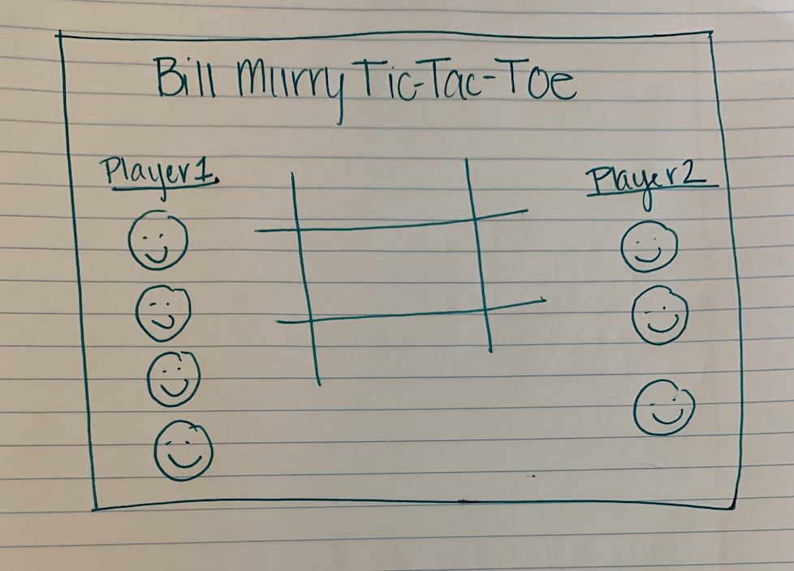
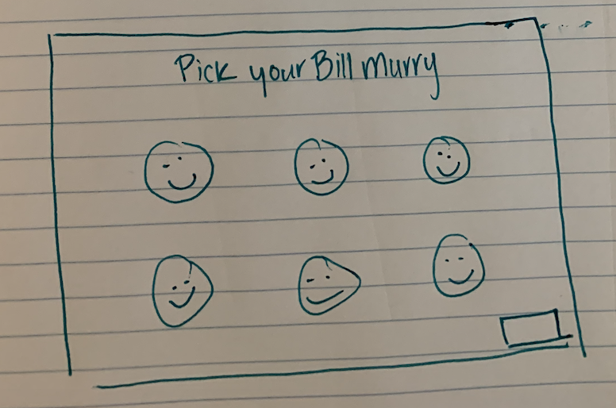
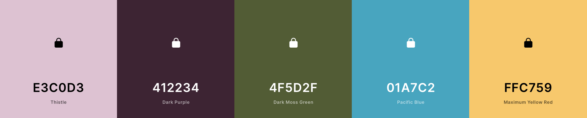
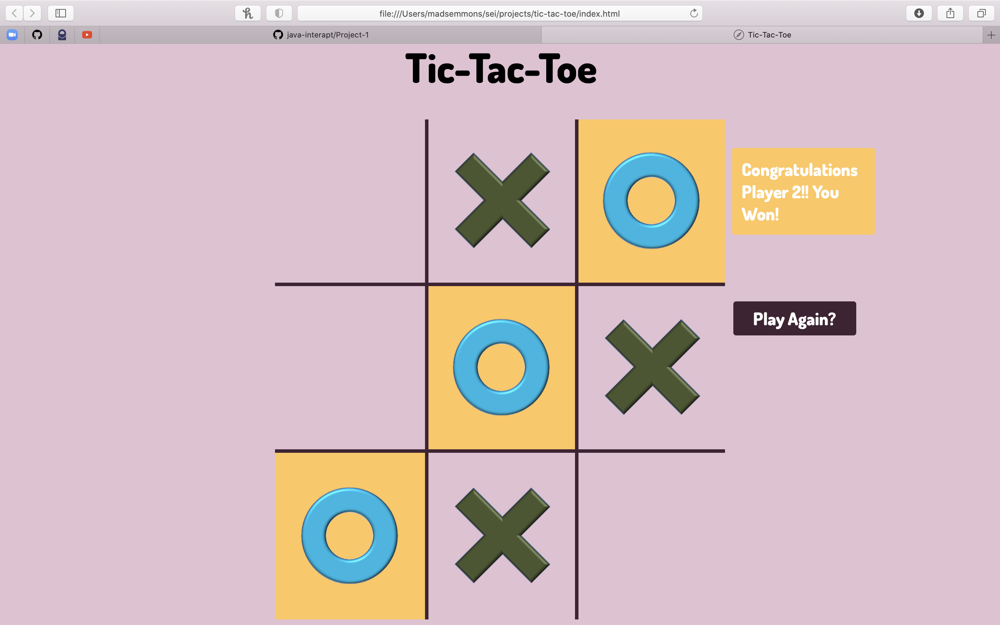
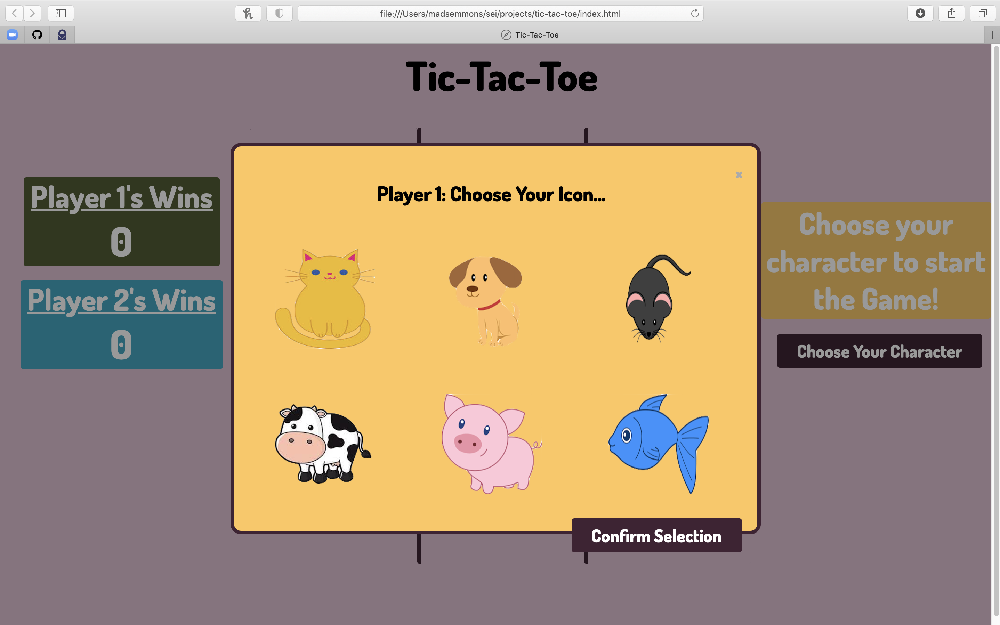
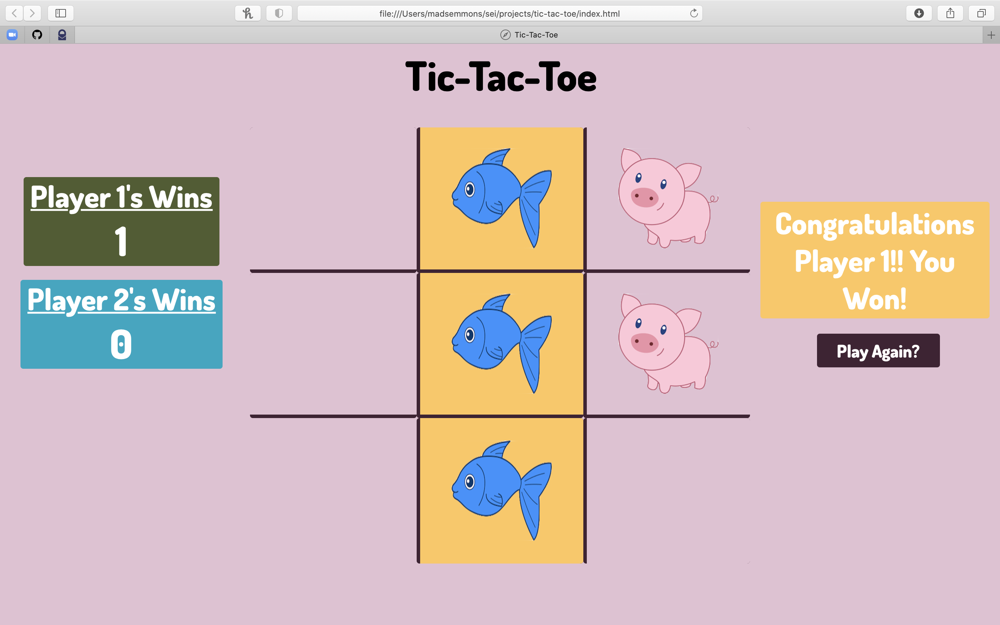
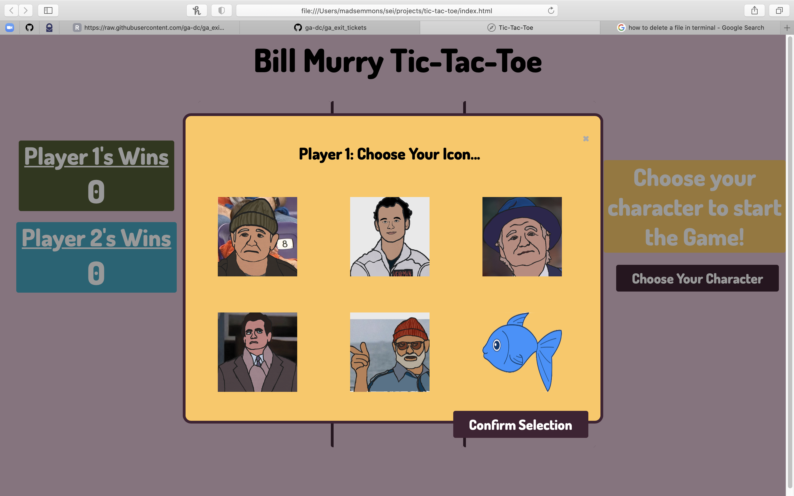
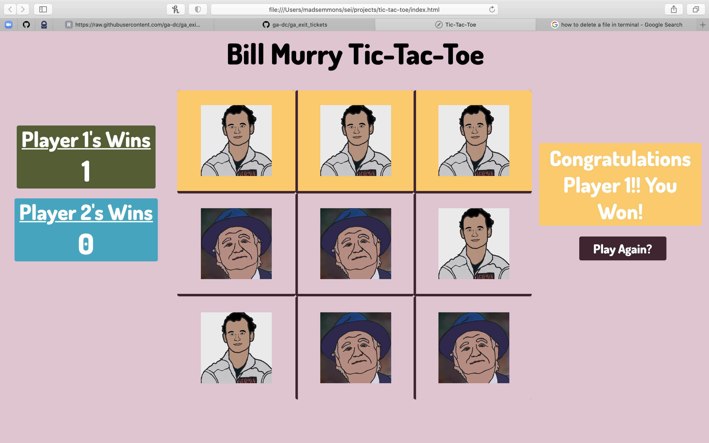

# Tic-Tac-Toe
This project is a two player Tic-Tac-Toe game that allows the user to choose their own icon for X or O and play 
multiple rounds or the game.  The interface will keep track of the score of each player and switch off who goes first 
to make the game fair. To play this game on your browser, follow this link: https://madeleinee123.github.io/tic-tac-toe/

## Design Process
The game was developed by creating user stories, drawing wireframes, writing pseudocode, and finally implementing the 
code.  Below is a chronological summary of each step of the process.

### User Stories
- As a user, I want to be notified when the game is over, so I know to stop clicking.
- As a user, I want to be notified who won the game, so I know if I won. 
- As a user, I want to be able to choose my icon, so I feel more connected to the game. 
- As a user, I want there to be a reset button, so I can reset the board if I make a wrong move. 
- As a user, I want to be able to track which player has won over multiple games, so I can have a more competitive. 
  gaming experience.
  
#### Features based on User Stories
- An interactive interface that alerts the user when it is their turn, when the game is over, and the game's outcome.
- A way for the users to choose their icons. 
- A button that allows the players to reset their game board. 
- A pleasing color scheme and layout. 
- A score tracker that lets the users see who has won over multiple rounds. 
  
### Wireframes
#### Game Play Screen

#### Character Selection Screen

#### Color Palette


### PseudoCode
This can be seen throughout the script.js file in the form of inline comments. 

### Implementation/Technologies Used
The implementation of the TicTacToe game is written in JavaScript, HTML and CSS. It can be run on a 
browser using GitHub pages using this link: https://madeleinee123.github.io/tic-tac-toe/.
### Final Product 
#### MVP Bronze:

##### Features:
- Reset Button
- Notifies User who won
- Highlights winning squares
#### MVP Silver:


##### New Features:
- User can pick which icon they want
- The scores over multiple rounds are displayed on the screen
#### MVP Gold
##### New Features: 
- It is Bill Murray themed now



## Installation Instructions
Fork and clone the repository onto your local device and have at it.
If you want to see your updates live, go into the repository's directory in your
terminal and run the command: 
```
open index.html 
```
## Contribute
If you find errors, please let me know. I'm sure there are many. You can do this 
by creating an issue using the link below:
- source code: https://github.com/madeleinee123/tic-tac-toe
- issue tracker: https://github.com/madeleinee123/tic-tac-toe/issues
